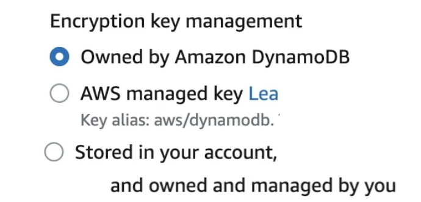
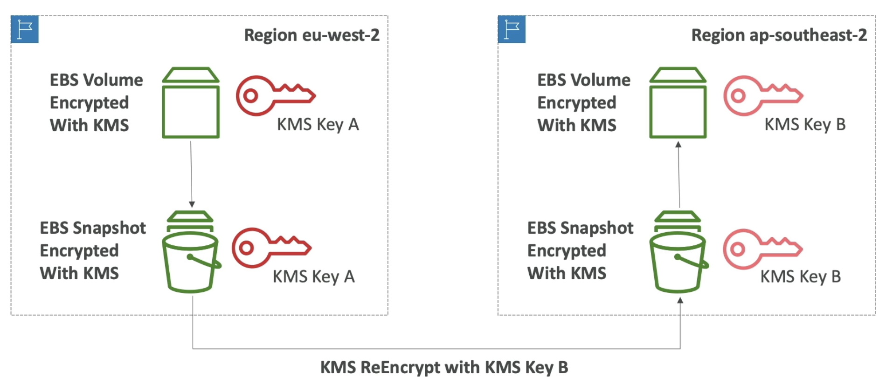
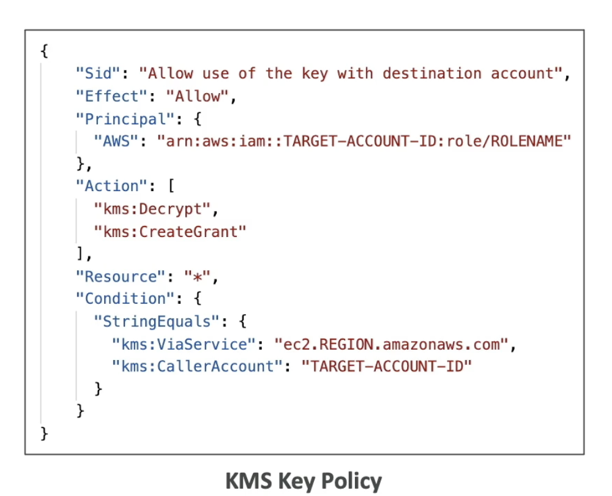
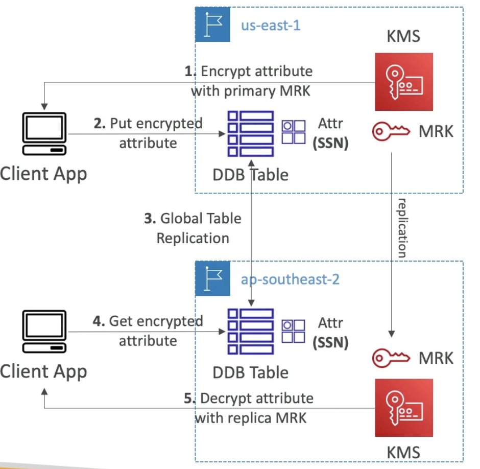

# KMS Keys

  - Anytime you hear "encryption" for an AWS service, its most likely KMS
  - AWS manages encryption keys for us.
  - Fully integrated with IAM for authorization
  - Easy way to control access to your data 
  - Able to audit KMS key usage (API call) using CloudTrail
  - Seamlessly integrated into most AWS services (EBS, S3, RDS, SSM ..)
  - **Never store your secrets in plaintext, especially in your code!**
    - KMS key encryption also available through API calls (SDK, CLI)
    - Encrypted secrets can be stored in code / environment variables.

- **KMS Key Types**
    - KMS Keys is the new name for KMS Customer Master Key.
    - **Symmetric (AES-256 keys)**
        - Single encryption key that is used to Encrypt and Decrypt
        - AWS services that are integrated with KMS use Symmetric CMKs
        - You will never get access to the KMS key unencrypted (must call KMS API to use)
    - **Asymmetric (RSA and ECC key pairs)** 
        - Public (Encrypt) and Private Key (Decrypt) pair.
        - Used for Encrypt/Decrypt, or Sign/Verify operations
        - The public key is downloadable, but you cant access the Private key unencrypted (only through APIs)
        - Use case: Encryption outside of AWS by users who cant call the KMS API.

- **Types of KMS Keys**
    - AWS Owned Keys (**free**): SSE-S3, SSE-SQS, SSE-DDB (default key)
    - AWS Managed Key: **free** (aws/service-name ex: aws/rds, aws/ebs) (can be used only from within the service that its assigned to.)
    - Customer managed keys created in KMS: $1 /month
    - Customer managed keys imported (must be symmetric key): $1 / month
    - + pay for API call to KMS ($0.03 / 10000 calls)
    

- **Automatic Key Rotation**
    - AWS managed KMS Key: automatic every year
    - Customer-managed KMS key: (must be enabled) automatic every 1 year.
    - Imported KMS key: only manual rotation possible using alias.

- **Copying Snapshots Across Regions**
    - **KMS keys are scoped per region**
    
    (For copying first we take a snapshot of the encrypted EBS volume which will be itself encrypted using the same key)  
    (To copy the Snapshot we re-encrypt the snapshot using a different KMS key. This AWS will do for you)  
    (Same KMS key cannot live in 2 different regions hence re-encryption is needed)  
    (Next we restore the Snapshot in the required region, and the volume is encrypted with a different key)  

- **KMS Key Policies**
    - Control access to KMS keys, "similar" to S3 bucket policies
    - Difference: you cannot control access without them (if you dont have KMS key policy then noone can access the keys)
    - **Default KMS Key Policy**
        - Created if you dont provide a specific KMS Key Policy.
        - Complete access to the key to the root user = entire AWS account
        - If you have an IAM policy allowing the user/role to access this key policy then this is good.
    - **Custom KMS Key Policy**
        - Define users, roles that can access the KMS key
        - Define who can administer the key
        - Useful for cross-account access of your KMS key

- **Copying Snapshots across Accounts**
    1. Create a snapshot, encrypted with your own KMS Key (Customer Managed Key) (Must be CMK because we need to attach custom key policy)
    2. **Attach a KMS Key Policy to authorize cross-account access**
    3. Share the encrypted snapshot with the target account
    4. (in target) Create a copy of the Snapshot, encrypt it with a different CMK in that target account.
    5. Create a volume from the snapshot in the target account.

    

# KMS Multi-Region

  - Identical KMS key in different AWS Regions that can be used interchangeably
  - Multi-Region keys have the same key ID, key material, automatic rotation ...
  - Encrypt in one Region and decrypt in other Regions
  - No need to re-encrypt or making cross-Region API calls
  - KMS Multi-Region are NOT global (Primary + Replicas)
  - Each Multi-Region key is managed **independently** (with its own key policy and so on)
  - Not recommended to use Multi-region keys, except in specific use cases, because KMS likes the fact that its be bounded by regions.
  - **Use Cases**: global client-side encryption (encrypt client-side in one regions and decrypt client-side in another region), encryption on Global DynamoDB, Global Aurora.

- **DynamoDB Tables & KMS Multi-Region Keys**
    - We can encrypt specific attributes client-side in our DynamoDB table using the **Amazon DynamoDB Eccryption Client**
    - Idea is not to ecrypt the whole table which is encryption at disk, but to ecrypt the attributes in the table fo ex SSN.
    - This data is then available only to specific clients not even to database administrators.
    - Combined with **Global Tables**, the client side encrypted data is replicated to other regions.
    - If we use a multi-region key, replicated in the same region as the DynamoDB Global table, then clients in these regions can use low-latency API calls to KMS in their region to decrypt the data client-side.
    - Using client-side encryption we can protect specific fileds and gurantee only decryption if the client has access to an API key.
    - We can protect specific attributes from even the database admins.

    
    (In the above ex, we have two regions, us-east-1 and ap-southeast-2, and KMS service is having Multi-region key)  
    (If Client application wants to insert data into a DynamoDB table, then it first encrypt the attribute with the primary Multi-region key)  
    (For ex only the SSN key is encrypted, if the DB admins dont have the keys then they will not be able to access it)  
    (The client app in another region with Global Table replication retrieves the row and then decrypt the attribute using an API call with the replica Multi-region Key)  
    (With this client apps in ap-southeast-2, can do local API calls to KMS to decrypt that one attribute)

    - Same logic for **Aurora DB** too, the only difference, the encryption happens using **AWS Encryption SDK** as opposed to the DynamoDB Encryption client.
