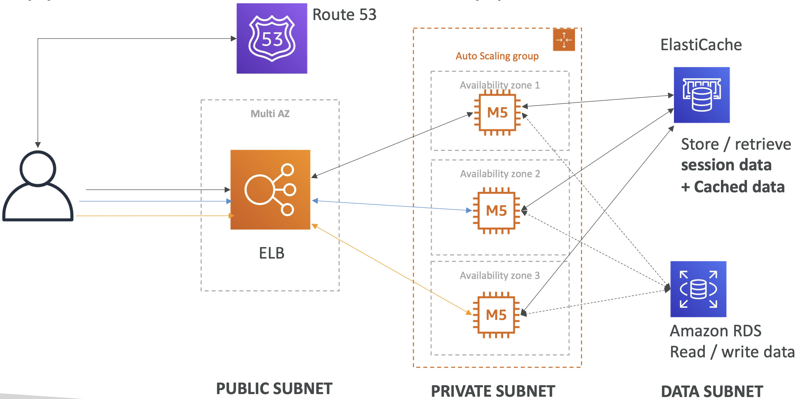

# Instantiating Applications quickly

- When launching a full stack (EC2, EBS, RDS), it can take time to:
    - Install applications
    - Insert initial (or recovery) data
    - Configure everything
    - Launch the application
- We can take advantage of the cloud to speed that up!

- **EC2 Instances**:
    - **Use a Golden AMI**: Install your applications, OS dependencies etc.. beforehand and create and AMI and then launch your EC2 instance from the Golden AMI.
        - We could then launch with everything installed, ready to go and hence fastest way to start EC2 instances.
    - **Bootstrap using User Data**: (can be done to install OS dependency etc but this will make it very slow) For dynamic configuration (retrieving URL of DB and passwd etc ), use User Data scripts
    - Hybrid: mix Golden AMI and User Data (Elastic Beanstalk)
- **RDS Databases**:
    - Restore from a snapshot: the database will have schemas and data ready!
- **EBS Volumes**:
    - Restore from a snapshot: the disk will already be formatted and have data!

# Simple: Web App 3-tier

- LB takes requests from the users, then ASG in Multi-AZ with EC2 instances deployed, and then in the backend data subnets with RDS to take reads and writes and Cache layer with ElastiCache
- Most web-applications will have similar architecture. As a developer, we want a single way of deploying the application. And this is where Beanstalk comes to help.

# Developer problems on AWS

- Managing infrastructure
- Deploying Code
- Configuring all the databases, load balancers, etc • Scaling concerns
- Most web apps have the same architecture (ALB + ASG)
- All the developers want is for their code to run!
- Possibly, consistently across different applications and environments

# Beanstalk

- Elastic Beanstalk is a developer centric view of deploying an application on AWS
- It re-uses all the component’s we’ve seen before: EC2, ASG, ELB, RDS, ...
- Managed service
    - Automatically handles capacity provisioning, load balancing, scaling, application health monitoring, instance configuration, ...
    - Just the application code is the responsibility of the developer
- We still have full control over the configuration of each component.
- Comes bundled as a single interface.
- Gives a way to update the applications
- Beanstalk is free but you pay for the underlying instances
- CloudFormation allows to create the resources behind the scenes for Beanstalk. And we can view this in the designer.

- **BeanStalk Components**
    - **Application**: collection of Elastic Beanstalk components (environments, versions, configurations, ...)
    - **Application Version**: an iteration of your application code
    - **Environment**
        - Collection of AWS resources running an application version (only one application version at a time in an env)
        - **Tiers**:Web Server Environment Tier & Worker Environment Tier
        - You can create multiple environments (dev, test, prod, ...)

    

- **Supported Platforms**
    
    - Go, Java SE, Java with Tomcat, .NET Core on Linux .NET on Windows Server, Node.js, PHP, Python, Ruby, Packer Builder
    - Single Container Docker, Multi-container Docker, Preconfigured Docker
    - If not supported, you can write your custom platform (advanced)

# Web Server Tier vs.Worker Tier

- Web Tier is the traditional architecture, we have an LB, sending traffic to an ASG that has multiple EC2 instances, that are going to be the web-servers. This is one architecture with Beanstalk
- Worker architecture with Beanstalk, doesnt have clients accessing EC2 isntances directly. It has an SQS queue, and when a message is sent to the queue, the EC2 instances are going to be workers which will pull messages from the SQS queue to process them. In this case worker environment is going to scale based on the number of SQS messages. So more messages more EC2 instances.
- Can but the Web and Worker environment together by having web tier pushing messages to the SQS queue for worker environment.

# Elastic Beanstalk Deployment Modes

- Single instance (for dev) will have one EC2 instance, with Elastic IP address, and can launch RDS and so on..But based on one instance with Elastic IP.
- High Availability for prod with LB distributing load across multiple EC2 instances, managed for ASG and multi-AZ. This also can have RDS that also with Multi-AZ with master and standby.