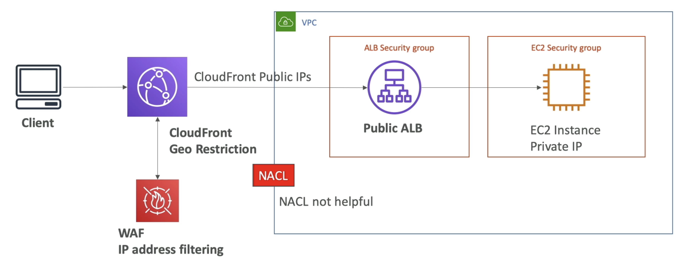

# Blocking an IP Address

(We have an EC2 instance ina security group, in a VPC, has a public IP and we want ot block a particular IP)  
- First Line of Defence, **NACL**- at VPC level - Create a denial rule for this IP address.
- In the **security group** we cannot have deny rules, only allow rule. So we only have a subset of authorized client which can access the EC2 instance. But if our application is global, then we wont know all the IP addresses that will access our application and so security group will not be very helpful.
- You can run an optional Firewall s/w on EC2 to block the client. But if the request already reached the EC2 instance then it will have to be processed, and there will be CPU cost for processing the request.

- Here we introduced an ALB within our VPC. Now there are 2 security groups. The Application LB sits between the client and EC2 and can do something called **connection termination** and then initiate a new connection from the ALB into the EC2. The security group of EC2 must be configured to allow traffic from the security group of the ALB. For the security group of the ALB we need to allow clients. 
- If we know the range of the IP addresses then we can configure the security group. For global applications we have to allow everything. And then our level of defense will be the NACL.
- Something we can do to deny an IP at ALB is by installing **WAF**. But since its an additional service and a firewall service, its going to be expensive. At WAF we can do some complex filtering on IP addresses and can establish rules that will count for the request to prevent a lot of requests going at the same time from the client. So we can have more security of our ALB.
- WAF is installed on the ALB and we can define some rules and this can act as another line of defense.

- We can use **CloudFront** in front of our ALB. It sits outside our VPC.
- ALB needs to allow all the **CloudFront public IPs** coming from the edge locations and there is a list of it online.
- ALB then does not see the client IP but it will see only CloudFront public IP.
- In this scenario, NACL is not very helpful because it cannot block client IP addresses. 
- To block the client from CloudFront we have 2 possibilities, if attacked by a country use **CloudFront Geo Restriction** feature to restrict all clients from a country, OR if there is a specific IP we can again use **WAF** or Web application Firewall to do some IP filtering