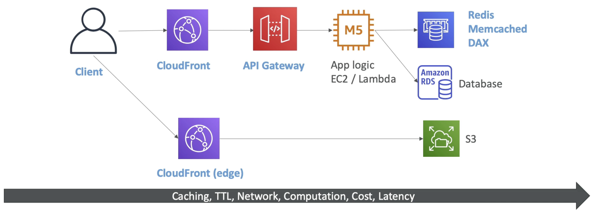

# Caching Strategies

  (The top route is usually for dynamic content and the static content route is where client goes through CloudFront which will source the data from S3)  
  (The arrow shows as we move caching along the line, there is more computation, cost and latency)  

- **CloudFront** does caching at the edge, as close to users as possible. If we enable caching and the user hit the cache they get a response right away, very quick.
    - Because its at the edge, its possible the content becomes outdated if it got changed in the backend. We can use a **TTL** to make sure the content the cache is renewed. 
    - We have a balancing act to do between how much more to cache at the edge vs in the app logic.
- **API Gateway** has some caching capabilities. Since API gateway is a regional service, the cache will also be regional. So there might be a network lag between the clients and the API gateway if the cache is in the API gateway.
- **App logic** will not do any caching on its own but will use Redis, memcached, or DAX for DynamoDB.
- If we dont want to hit our Database frequently, which does not have any caching capabilities, then we make sure that for frequent or complex queries we store the results into a **shared cache** that can be accessed by app logic more easily.

