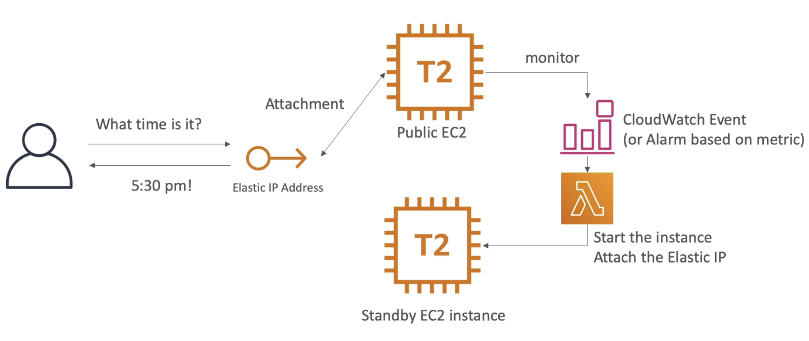
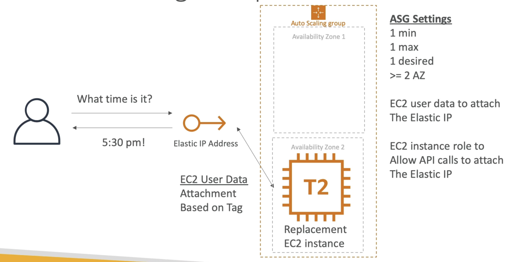
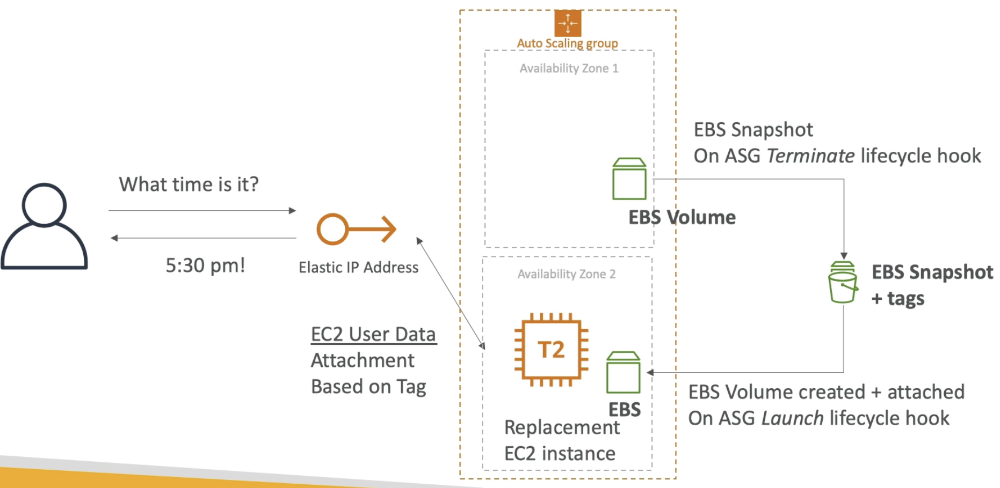

# Creating a Highly Available EC2 instance

    - EC2 instance by default is launched in one AZ.
    - Example if we have a public EC2 instance running a web server and if we want to access the web server, we will attach an Elastic IP to the instance, so our users can access it using the Elastic IP.
    - Creating a Standby EC2 instance to make it highly available.  
    - To know something went wrong with our EC2 instance we need to enable monitoring. For this we will use a CloudWatch event or an alarm based on an event for ex to see if the instance is getting terminated or if the CPU goes to 100% etc.
    - This alarm can then trigger a Lambda function that will allow you to do whatever you want. Like issue API call to start the standby instance if it has not started yet and then attach the Elastic IP to the standby instance and detached from the other EC2 instance because one Elastic IP can be attached to only one instance at a time. The other EC2 instance can be terminated or disappear and effectively we have failed over to the Standby instance.

- **EC2 instance with ASG**

    - ASG in 2 AZs, and then an Elastic IP.
    - ASG is configured in a way that only 1 EC2 instance is active at a time.
    - On the user data of the EC2 instance, when it comes up its going to acquire and attach this Elastic IP address based on tags. So the user data will issue API calls and the Elstic IP will be attached to the public EC2 instance.
    - If this EC2 instance goes down the ASG will create a Replacement instance in another AZ, this new instance will run its EC2 user data scripts and attach the Elastic IP and the failover will happen this way.
    - Here we dont need a CloudWatch alarm or event, the ASG will take care of creating a new EC2 instance.
    - Since the EC2 instance does API calls directly to attach this Elastic IP Address then we need to have an instance role that allows to issue API calls.
    - We have EC2 user data to attach the Elastic IP and have an EC2 instance role to make sure the API call succeeds

- **ASG + EBS**

    - Just an extension of the above pattern where we have an EBS Volume too.
    - An EBS volume is locked into a specific AZ.
    - When the EC2 instance is being terminated, the ASG can use lifecycle hooks and create scripts to create EBS Snapshots. This will be trigerred as soon as the EC2 instance goes down.
    - The EBS snapshot is tagged correctly. 
    - ASG will launch a replacement instance in another AZ.
    - There will be another lifecycle hook configured on the ASG, for the Launch event which will create EBS volume from the snapshot in the correct AZ and then attach it to thr EC2 instance.
    - Elastic user data will attach the Elastic IP