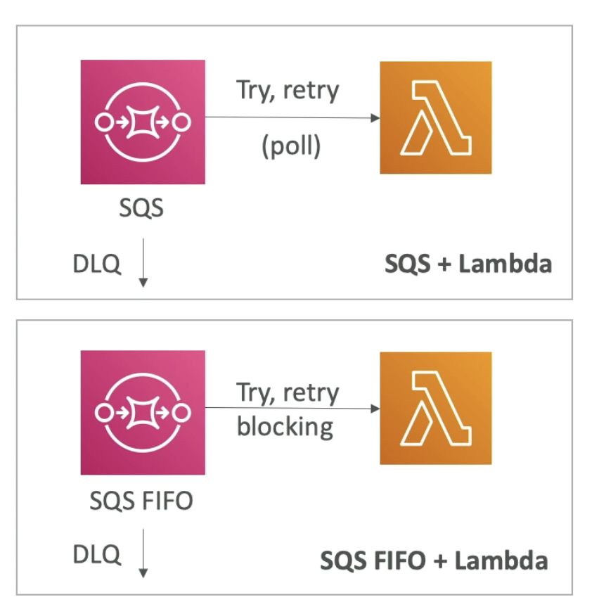
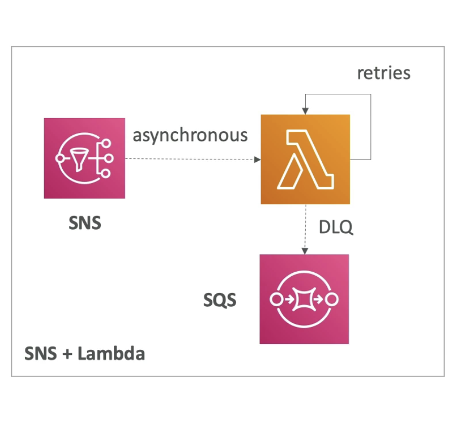
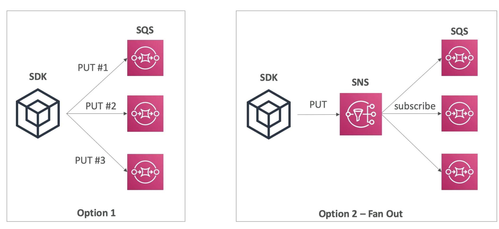
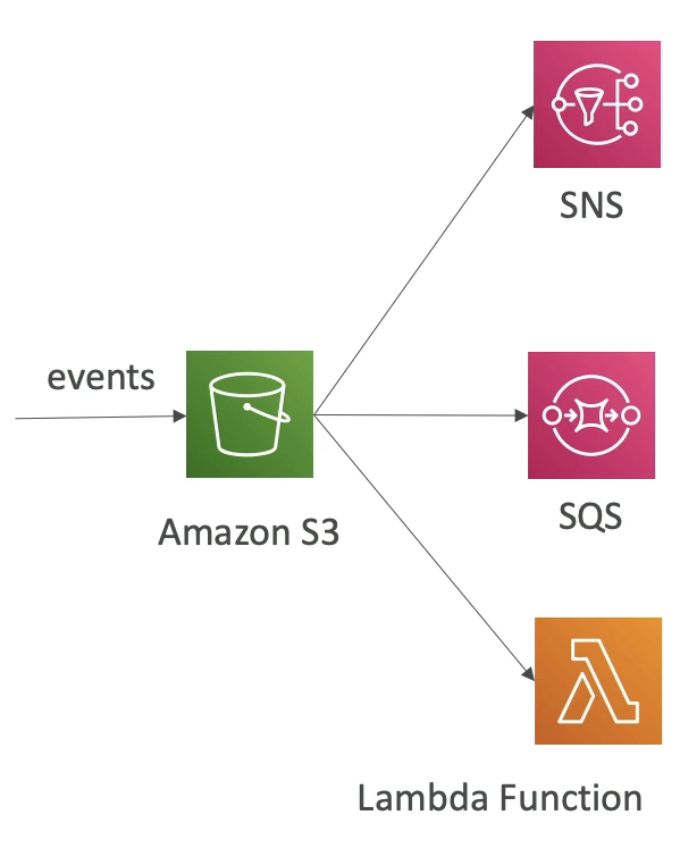
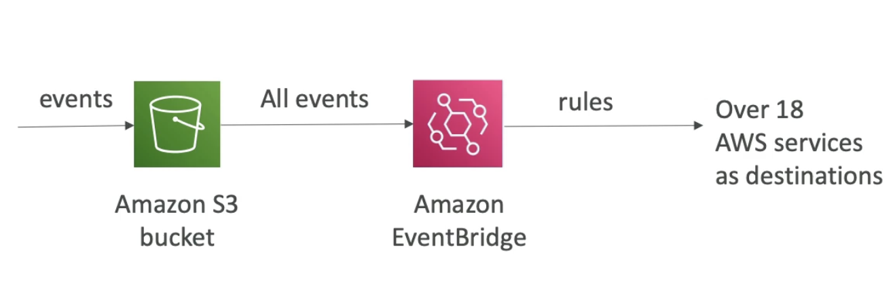
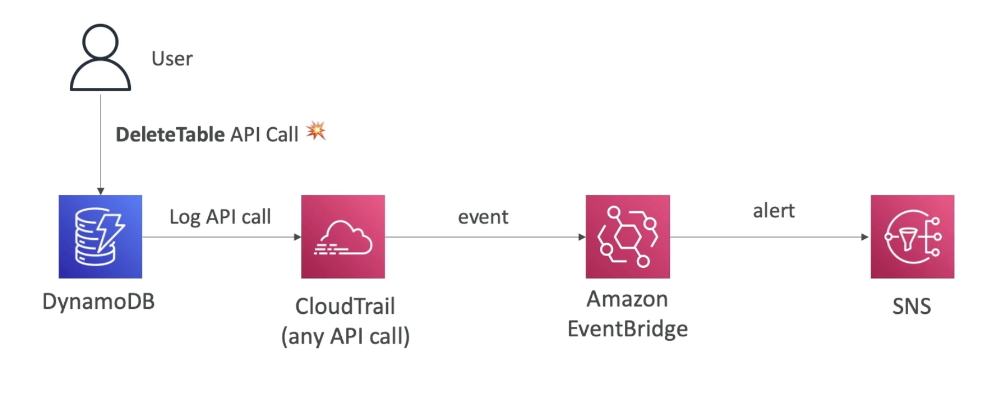
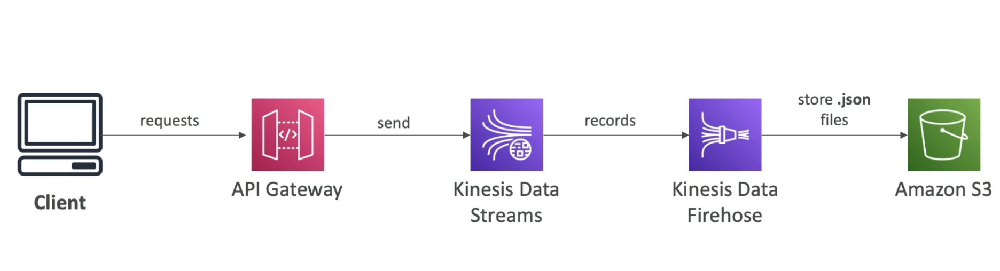

# Lambda, SNS & SQS

- **SQS + Lambda**

      
    (Event inserted to SQS and Lambda will poll the SQS queue)  
    (In case there is an issue the message will be put back into the SQS qeue and a retry will be attempted)  
    (If there is a big problmem with one of the messages, then this retry can lead into an infinite loop)  
    (Solution is to set a **Dead Letter Queue** in SQS after say 5 retries)
    (Same logic of DLQ can be applied to the **SQS FIFO + Lambda**, if the message ordering is broken due to some message not going through which will cause the whole queue processing to be blocked)  

- **SNS + Lambda**
      
    (Messages are sent asynchronously to Lambda)  
    (Lambda function has a different retry behavior, in case it cannot process the message it keeps trying internally)  
    (After a few retries, we can either discard the message or we can put the message in a DLQ again, but this time at Lambda service level)  

# Fan Out Pattern: deliver to multiple SQS  

   
(Option 1, we have our application and AWS SDK is installed on it, if we need to deliver messages to 3 SQS then we can deliver them in sequence one after the other but not very reliable because if the application crashes after sending to #2 then #3 will never receive the message and hence content of each queue will be different)  
(Option 2 is to use a fan-out pattern, which is to combine the SQS queue with an SNS topic in the middle. This solution has higher guarantee.)

# S3 Event Notification

- React to specific events on bucket such as: S3:ObjectCreated, S3:ObjectRemoved, S3:ObjectRestore, S3:ObjectReplication ...
- Can do Object name filtering (*.jpg)
- Use case: generate thumbnails of images uploaded to S3.
- **Can create as many "S3 events" as desired**
- S3 event notification typically deliver events in seconds but can sometimes take a minute or longer.

# S3 Event Notification with EventBridge

  

- Why to use EventBridge?
    - **Advanced filtering** options with JSON rules (metadata, object size, name..)
    - **Multiple Destinations** - ex Step Functions, Kinesis Streams / Firehose ..
    - **EventBridge Capabilities** - Archive, Replay Events, Reliable delivery

# EventBridge - Intercept API Calls

- You can intercept any API call with Amazon EventBridge using integration with CloudTrail
- For example if you want to react to events of a user deleting a table from DynamoDB, then this API call (as well as all other API calls) will be logged in CloudTrail which will trigger an event in EventBridge and from this you can create alerts to SNS.

# API Gateway - AWS Service Integration

- **Kinesis Data Streams Example**
    - You can have external events into AWS using API Gateway which will send messages into Kinesis Data Streams. The records will end up in Kinesis Data Firehose and then end up in S3.
