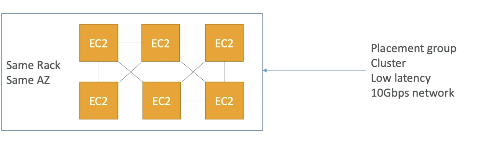

# High Performance Computing (HPC)

- The cloud is the perfect place to perform HPC
- You can create a very high number of resources in no time
- You can speed up time to results by adding more resources
- You can pay only for the systems you have used
- Once you are done you can destroy the infrastructure and not be billed at all.
- Can have extremely high number of instances doing the computation for us, and then be done and pay only for what we used.  
  
- Used to perform genomics, computational chemistry, financial risk modeling, weather prediction, machine learning, deep learning, autonomous driving

- **Data Management & Transfer**

    - **AWS Direct Connect**
        - Move GB/s of data to the cloud, over a private secure network
    - **Snowball & Snowmobile**
        - Move PB of data to the cloud. For big data transfers or one-off transfers.
    - **AWS DataSync**
        - Install datasync agent and Move large amount of data between on-premise and S3, EFS or FSx for Windows

- **Compute and Networking**

    - **EC2 Instances**
        - CPU optimized, GPU optimized based on the computation we are trying to do.
        - Spot Instances/Spot Fleets for cost savings + Auto Scaling
    - **EC2 Placement Groups** : **Cluster** for good network performance
        - If EC2 instances need to talk to one another, and perform computation in distributed manner then placement group of type cluster is great as we have low latency sue to best network performance.
        - For the cluster placement group, everything is in the same rack and on the same AZ as shown in the diagram.
        

    - **EC2 Enhanced Networking (SR-IOV)**
        - Higher bandwidth, higher PPS (packet per second), lower latency
        - To get this enhanced networking there are 2 options:
            - Option 1: **Elastic Network Adapter (ENA)** up to 100Gbps
            - Option 2: Intel up to 82599 VF up to 10 Gbps - LEGACY (Old ENA)

    - **Elastic Fabric Adapter (EFA)**
        - Improved ENA for **HPC**, only works for **Linux**
        - Great for inter-node communications, **tightly coupled workloads** (think about distributed computation)
        - Leverages Message Passing Interface (MPI) standard
        - Bypasses the underlying Linux OS to provide low-latency, reliable transport
        - If you have a Linux instance, and you are performing tightly coupled workloads, then using EFA, will bypass OS and provide higher n/w performance.

- **Storage**

    - **Instance-attached storage**
        - **EBS:** scale up to 256,000 IOPS with io2 Block Express
        - **Instance Store:** Scale to millions of IOPS, linked to EC2 instance, low latency. We can lose data if we lose the instance.
    - **Network Storage**:
        - **S3:** large blob, not a file system (store large objects)
        - **EFS:** scale IOPS based on total size, or use provisioned IOPS (to get higher IOPS)
        - **FSx for Lustre:** (dedicated to HPC) (Linux and cluster)
            - HPC optimized distruted file system, millions of IOPS
            - Backed by S3

- **Automation and Orchestration**

    - AWS Batch
        -**AWS Batch** supports multi-node parallel jobs, which enables you to run single jobs that span multiple **EC2** instances
        - Easy schedule jobs and launch EC2 isntances accordingly
        - Very Popular for HPC and managed by Batch service.
    - AWS Parallel Cluster
        - Open source cluster management tool to deploy HPC on AWS
        - Configure with text files
        - Automate creation of VPC, subnet, cluster type and instance types
        - **Ability to enable EFA on the cluster (improves network performance)** (There is a parameter in the text file to enable EFA)
