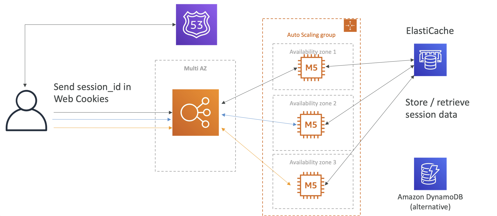

# Stateful Web App: MyClothes.com

- MyClothes.com allows people to buy clothes online.
- There’s a shopping cart
- Our website is having hundreds of users at the same time
- We need to scale, maintain horizontal scalability and keep our web application as stateless as possible (We still have state for the shopping cart)
- Users should not lose their shopping cart
- Users should have their details (address, etc) in a database

# Starting simple

- Basic architecture with Route 53, Multi-AZ ELB, ASG Multi-AZ.
- Our application access ELB, and it redirects to an instance and the shopping cart is created.
- Next time another instance will serve the user, and the shopping cart will be lost.

# Introduce Stickiness (Session Affinity)

- We introduce stickiness or session affinity which is an ELB feature.
- And now the user will be always redirected to the same instance.
- But if the EC2 instance terminates, then we still lose our cart.

# Introduce User Cookies

- Instance of EC2 instances storing the shopping cart, the user will store the cart.
- This is done through web cookies.
- Now whichever instance the user get connected to, each instaance will know the cart contents through these cookies.
- We achieved statelessness through this approach but our HTTP requests become heavier.
- Some level of security risk also as someome can alter the cookies.
- In this kind of architecture, we need to validate the user cookies.
- Cookies must be less than 4 KB.

# Introduce Server Session

- Another improvement can be that instead of sending the whole cart, we send session ID.
- In the backend we will have an ElstiCache.
- When we send a session ID, we talk to the EC2 instance and say we add things to the cart, then the EC2 instance will add the cart content to the ElastiCache alongwith the session ID.
- If the next request goes to another EC2 instance, then it will retrieve the cart using the session ID from the ElastiCache.
- ElatiCache has sub-millisecond performance. Its also secure because attackers can not change the cart content now.
- Another approach could be to use DynamoDB.

# Storing User Data in a database

- For storing user data, we can use RDS, which is like long term storage and each instance can talk to it independently.
- This is again and Multi-AZ stateless solution.

# Scaling Reads

- For scaling reads, we can use RDS master, which takes the writes, and then create replicas for reads.
- We can have upto 15 read replicas in RDS to scale our read capacity.

# Scaling Reads (Alternative) – Lazy Loading
  
- We can use Lazy-loading discussed earlier to look for information in the cache and then lookup the DB only in case of a miss.
- This allows us to have less traffic on RDS and decrease CPU usage on RDS, therby improving performance.
- But need to do cache maintenance which is a bit difficult and needs to be done at the application side.

# Multi AZ – Survive disasters
  
- Route 53 is already highly available, no need to do anything there
- Enable Multi-AZ at ELB, ASG also multi ALB, RDS has a Multi-AZ feature, the other one will be a stand-by replica, ElastiCache also has multi-AZ feature if you use Redis.

# Security Groups

- We open HTTP/HTTPS traffic from anywhere on the ALB.
- For the EC2 instance, traffic should come only from the ALB.
- For ElastiCache traffic only from EC2 SG.
- For RDS also traffic only from EC2 SG.

# Summary
- ELB sticky sessions
- Web clients for storing cookies and making our web app stateless
- ElastiCache
    - For storing sessions (alternative: DynamoDB)
    - For caching data from RDS
    - Multi AZ
- RDS
    - For storing user data
    - Read replicas for scaling reads
    - Multi AZ for disaster recovery
- Tight Security with security groups referencing each other