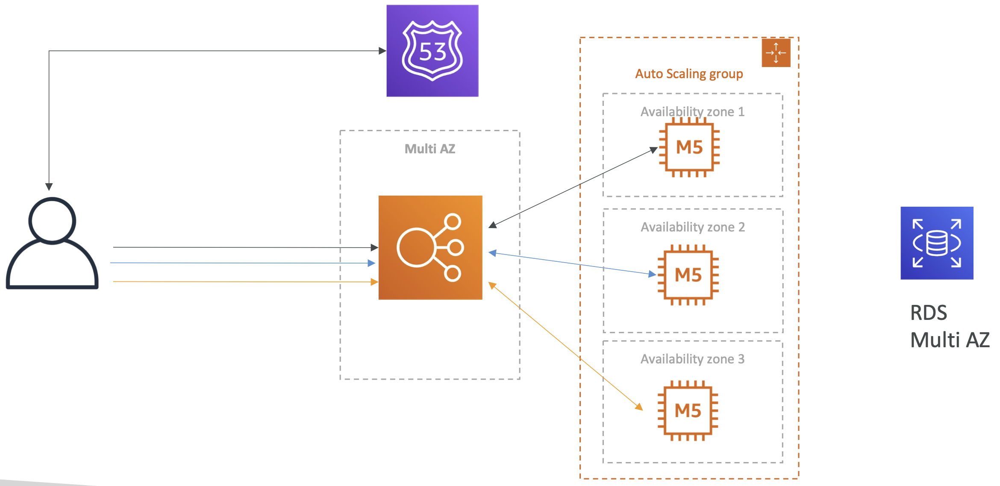
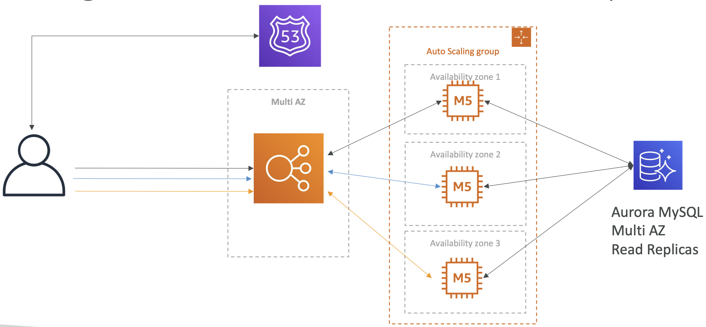
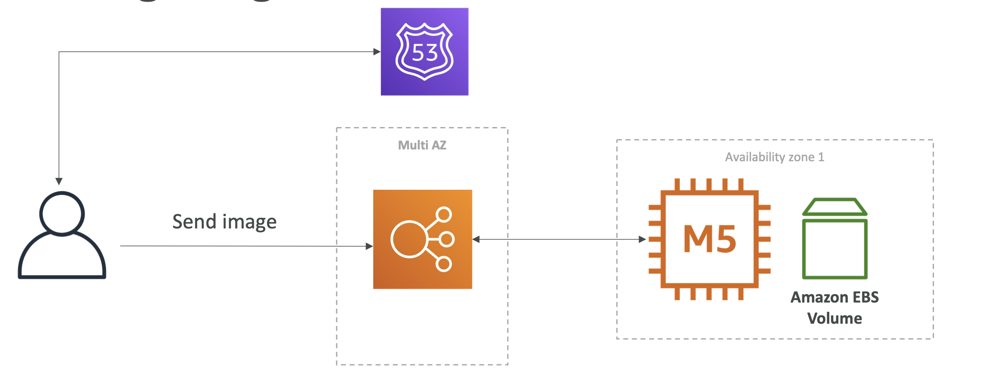
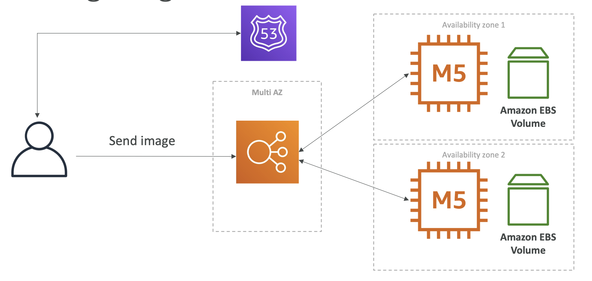
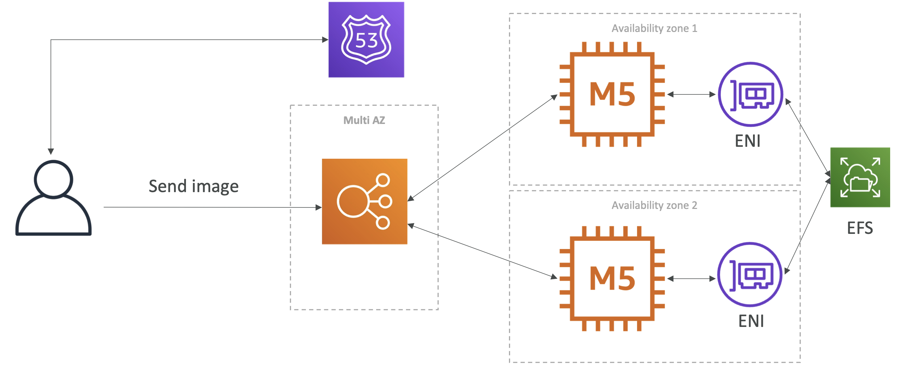

# Stateful Web App: MyWordPress.com

- We are trying to create a fully scalable WordPress website
- We want that website to access and correctly display picture uploads
- Our user data, and the blog content should be stored in a MySQL database

# RDS Layer

- RDS in the backend with Multi-AZ, Route 53, ELB ASG etc. Basic architecture.

# Scaling with Aurora: Multi AZ & Read Replicas

- RDS can be replaced with Aurora MySQL and can have multi-AZ, read replicas and even global database
- Its just a choice to opt for Aurora as it scales better, and easier to operate.

# Storing images with EBS 1

- Basic architecture with EC2 instance and EBS volume attached to it. Both in one AZ.
- The LB is connected to the instance in Multi-AZ.
- EBS volume stores the images.

# Storing images with EBS 2

- When we start scaling, we can have EBS volumes in multiple AZs.
- Then if we store an image in one EBS volume, we cannot access the images if we are connected to another instance.
- For this we will have to use EFS.

# Storing images with EFS

- So now we store the images in EFS drive, and EFS is NFS(Network File System) so it creates ENI (Elastic Network Interfaces)
- ENIs are created in each AZ, and can be used for all the EC2 instances.
- ENIs will be used to access the EFS which will be shared between the instances.
- Scales wesbite storage across many EC2 instances to be accessed from Multi-AZ.

# Summary

- Aurora Database to have easy Multi-AZ and Read-Replicas
- Storing data in EBS (single instance application)
- Vs Storing data in EFS (distributed application)
- EBS is cheaper than EFS but based on the situation we need to chose the right solution.