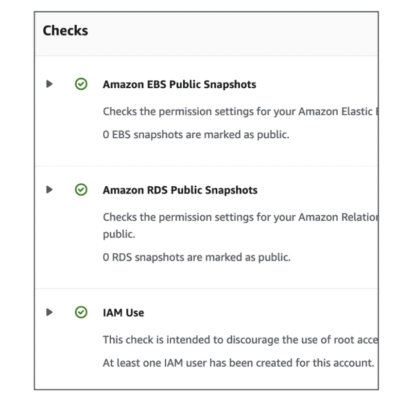

# Well Architected Framework

- Stop guessing your capacity needs. Instesd use auto-scaling group and so on.
- Test systems at production scale. With AWS you can perform big tests on big infrastructure and then shut them down in an hour.
- Automate to make archietctural experimentation easier. With CloudFormation template you can easily deploy in multiple environments to experiment. 
- Allow for evolutionary architectures
    - Design based on changing requirements. For ex start with EC2 and Load Balancer and evolve towards serverless architecture such as API Gateway and Lambda.
- Drive architectures using data. (Storage and so on)
- Improve through game days.

- **Six Pillars**
    <ol type="1">
    <li>Operational Excellence</li>
    <li>Security</li>
    <li>Reliability</li>
    <li>Performance Efficiency</li>
    <li>Cost Optimization</li>
    <li>Sustainability</li>
    </ol>
- There are not something to balance or trade-offs, they are a synergy.

- **AWS Well-Architected Tool**
    - Free tool to **review your architectures** against the 6 pillars and **adopt architectural best practices**
    - How does it work?
        - Select you workload and answer questions
        - Review your answers against the 6 pillars
        - Obtain advice: get videos and documentation, generate a report, see the results in dashboard.

# Trusted Advisor

- No need to install anything - high level AWS account assessment
- Analyze your AWS accounts and provides recommendation on 5 categories
    <ol type="1">
    <li>Cost optimization</li>
    <li>Performance</li>
    <li>Security</li>
    <li>Fault Tolerance</li>
    <li>Service Limits</li>
    </ol>

- Trusted Advisor - Support Plans
    - 7 Core checks on Basic & Developer plan
        <ol type="1">
            <li>S3 Bucket permissions - check Bucket is not public.</li>
            <li>Security groups - Specific Ports Unrestricted (such as SSH on port 22)</li>
            <li>IAM Use (One IAM user minimum)</li>
            <li>MFA on root account</li>
            <li>EBS public Snapshots - Check none are public</li>
            <li>RDS Public Snapshot - check there are none</li>
            <li>Service limits</li>
        </ol>
        - These top 6 checks fall under the category of security and under service limits we get a bunch of checks.
    
    - Full Check on Business and Enterprise Support Plan
        - Full checks available on the 5 categories
        - Ability to set CloudWatch alarms when reaching limits
        - **Programmatic Access using <u> AWS Support API </u>**
    