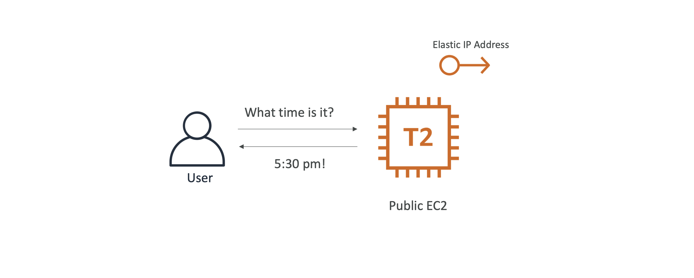
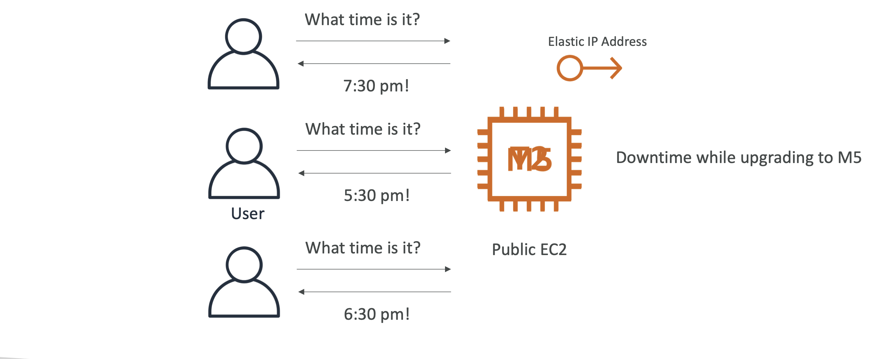
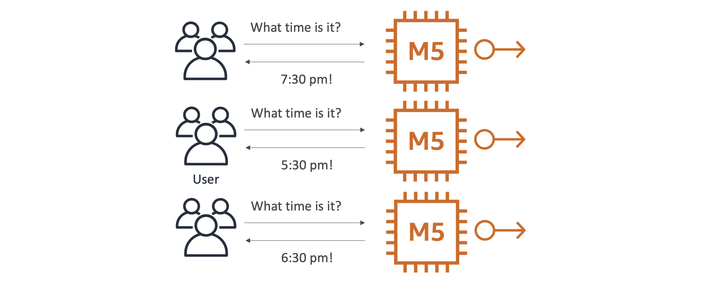
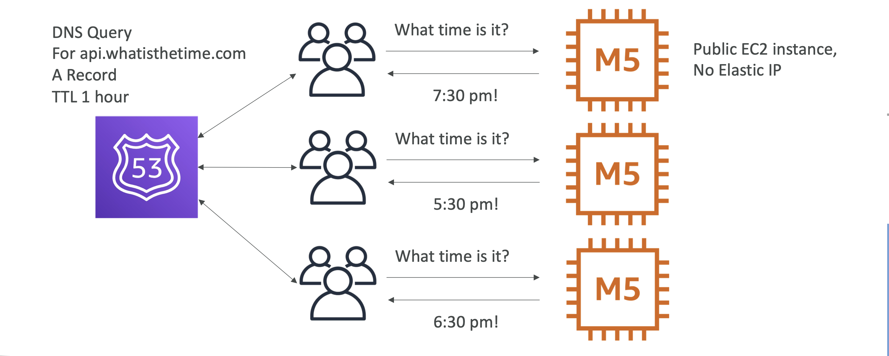
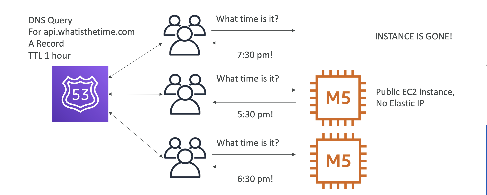
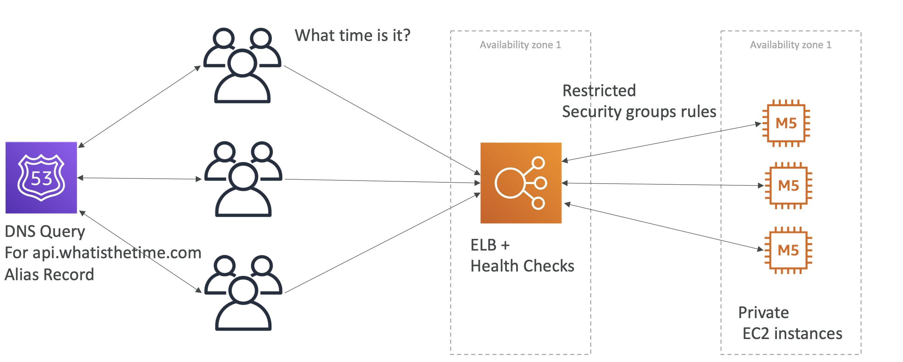
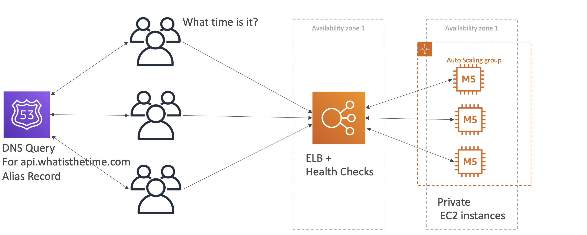
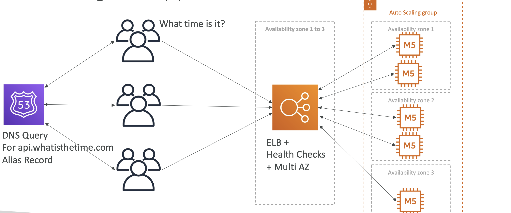
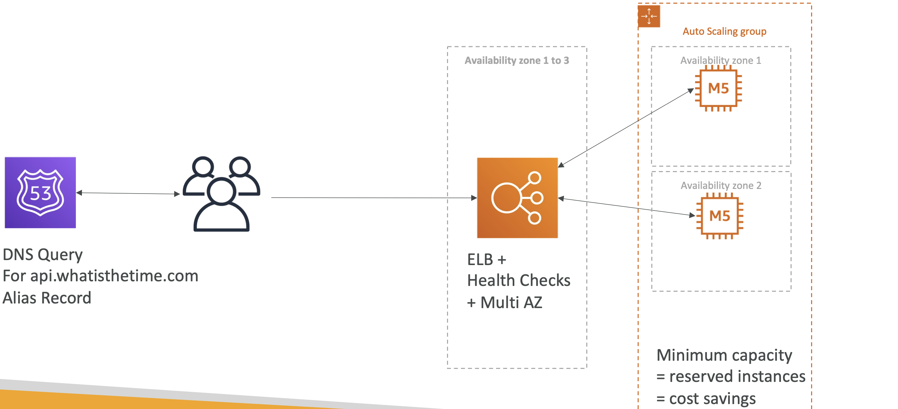

# Stateless WebApp: WhatIsTheTime.com

- WhatIsTheTime.com allows people to know what time it is
- We don’t need a database
- We want to start small and can accept downtime
- We want to fully scale vertically and horizontally, no downtime

# Starting simple

- T2 micro instance which is public which returns the time to the user
- To make the EC2 instance have a static IP address wwe will attach an Elastic IP address to it.

# Scaling vertically

- When number of users increases then we can increase the capacity of the EC2 instance by making it a M5 large instace. This is vertical scaling.
- We stop the existing instance, change the instance type and start the new instance.
- Since we have elastic IP address attached, the IP does not change but we have a downtime while upgrading.

# Scaling horizontally 1

- If the load increases much further then, we need to think horizaontal scaling
- We then start increasing the number of M5 large insances, but then now we have multiple Elastic IP addresses attached to each instance.
- Having multiple IP which users need to remember is not great solution.

# Scaling horizontally 2

- There is only 5 elastic IP per region, so lets remove the Elastic IP attached to the instances.
- Users will now leverage Route 53 and the website URL is api.whatisthetime.com and we make it an A record, with a TTL of 1 hour
- When users query the DNS it will return a list of IP from the A record type.
- Even if we add more IP addresses the users need not be aware of them as Route 53 will take care of the mapping and users will connect the the URL.

# Scaling horizontally, adding and removing instances

- In case one instance goes down, because the TTL is 1 hour, Route 53 might still return the IP address of the instance which is down.
- For other users they will be able to connect to the instances which are running.

# Scaling horizontally, with a load balancer

- We push all our instances into private instance within a single AZ.
- We introduce an ELB with health checks to take care of instances which goes down.
- Now the ELB is public facing and the EC2 instances are private, and then we will have to create security groups between the two.
- Now the users are still talking to Route 53, but now we need to change the A record type, because it needs to redirect the traffic to a load balancer, and LB has its IP changing all the time.
- An alias record pointing to the LB needs to be created in Route 53.
- Now we can add/remove instances and register them with the LB, and we dont have any downtime for the users as LB will do health checks to maintain the instances.

# Scaling horizontally, with an auto-scaling group

- We can now add Auto-scaling groups for our EC2 instances, to scale on demand.
- Now another problem that can happen is it our entire AZ goes down.

# Making our app multi-AZ

- For high availability we need to implement multi-AZ
- Again we will have ELB with health checks, and this time on Multi-AZ
- The ASG will also span on all the 3 AZ. So now in each AZ we can have say 2 instances.
- This is now highly available and resilient to failure.

# Minimum 2 AZ => Let’s reserve capacity

- To minimize the cost, lets change the ASG to reserve instance with minimum capacity.
- For on-demand temporary instances, we can use spot instances which are lower cost.

# Summary
- Public vs Private IP and EC2 instances
- Elastic IP vs Route 53 vs Load Balancers
- Route 53 TTL, A records and Alias Records
- Maintaining EC2 instances manually vs Auto Scaling Groups
- Multi AZ to survive disasters
- ELB Health Checks
- Security Group Rules
- Reservation of capacity for costing savings when possible
- We’re considering 5 pillars for a well architected application: costs(reserve instances, ASG with spot instance), performance (vertical scaling, ELB, ASG), reliability (Route53, Multi-AZ, ASG), security (Security groups), operational excellence