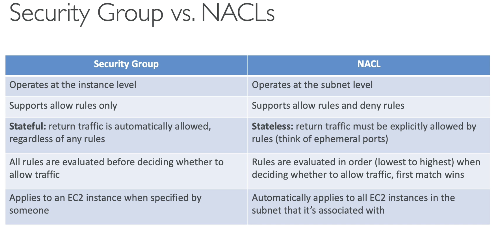

# CIDR-IPv4

  - **Classless Inter-Domain Routing** - a method for allocating IP addresses
  - Used in **Security Groups** rules and AWS networking in general
  - Consists of 2 components - **Base IP, Subnet Mask** 
  - Subnet mask allows part of the underlying IP to get additional next values from the base IP.

  

  - Example 192.168.0.0/24 = 192.168.0.0 - 192.168.0.255 (256 IPs)
            192.168.0.0/16 = 192.168.0.0 - 192.168.255.255 (65,536 IPs)
            134.56.78.123/32 = Just 134.56.78.123
            0.0.0.0/0 = All IPs
  - Can use CIDR to IP conversion websites.
  - The Internet Assigned Numbers Authority (IANA) established certain blocks of IPv4 addresses for the use of private LAN and public internet addresses
  - Private IP can only have certain values:
    - 10.0.0.0 - 10.255.255.255 (10.0.0.0/8) <- in big networks
    - 172.16.0.0 - 172.31.255.255 (172.16.0.0/12) <- **AWS default VPC** in that range
    - 192.168.0.0 - 192.168.255.255 (192.168.0.0/16) <- home networks
  - All the rest of the IP addresses on the Internet are public

# Security Groups and NACL

    

- **Network Access Control List (NACL)**
  - NACL are like a firewall which control traffic from and to **subnets**
  - One NACL per subnect, new subnects are assigned the default NACL
  - You define NACL rules
    - Rules have a number (1-32766), higher precedence with lower number
    - First rule match will drive the decision
    - Example: If you define #100 ALLOW 10.0.0. 10/32 and #200 DENY 10.0.0. 10/32, the IP address will be allowed because 100 has a higher precedence over 200
    - The last rule is an asterix (*) and denies a request in case of no rule match
    - AWS reccomends adding rules by increment of 100
  - Newsly created NACLs will deny everything
  - NACL are a great way of blocking a specific IP address at a subnet level

# 