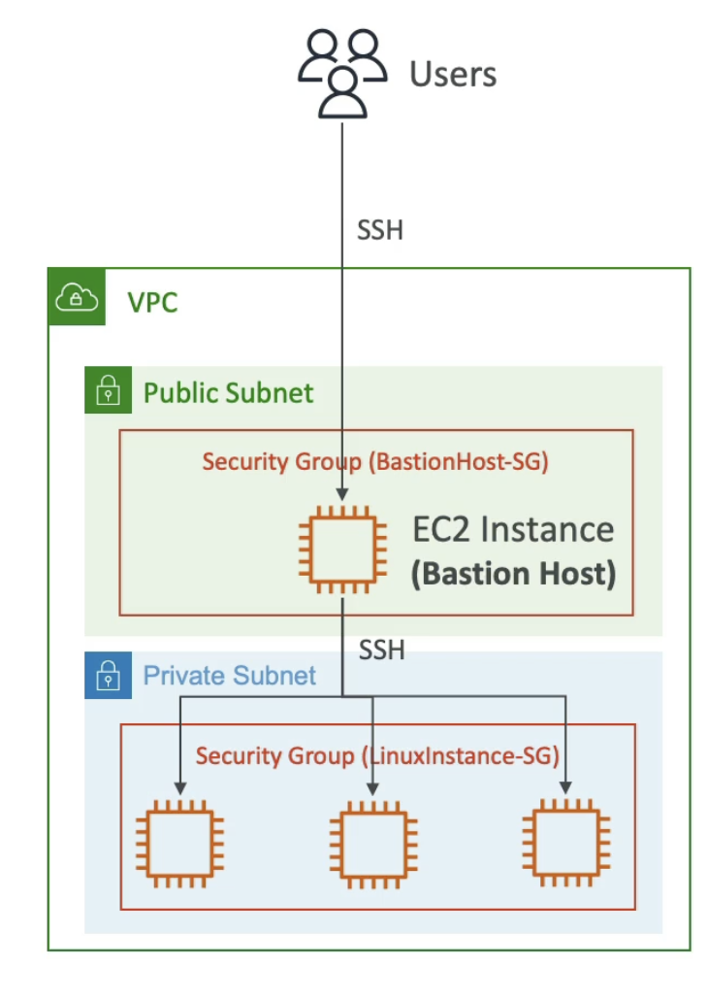
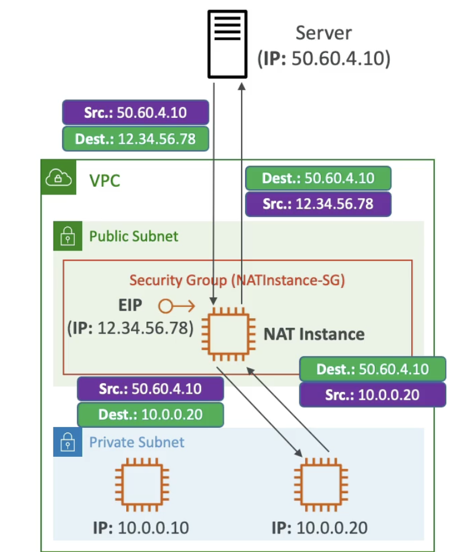
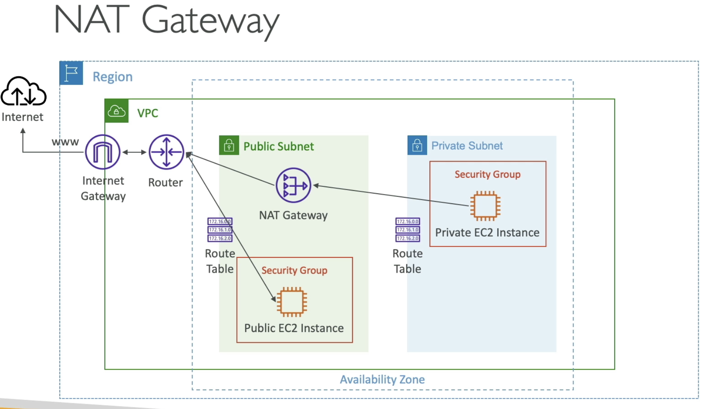
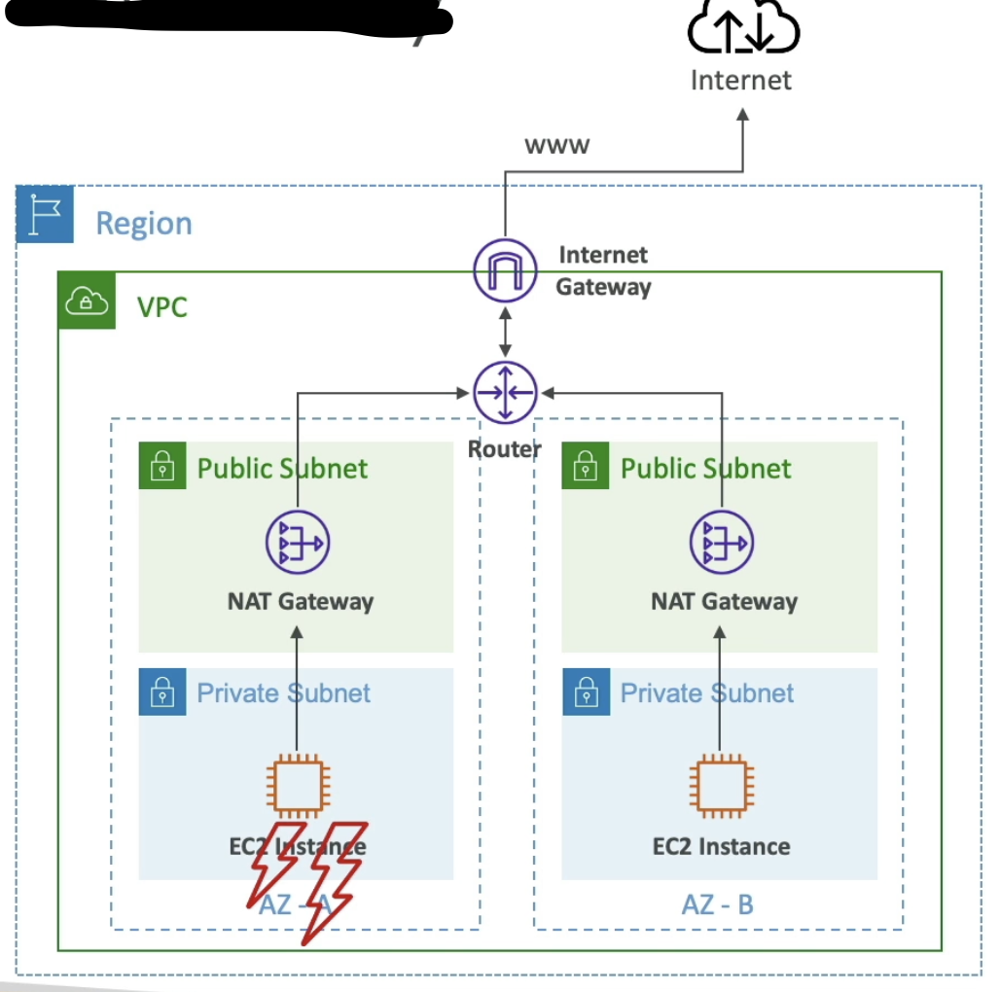
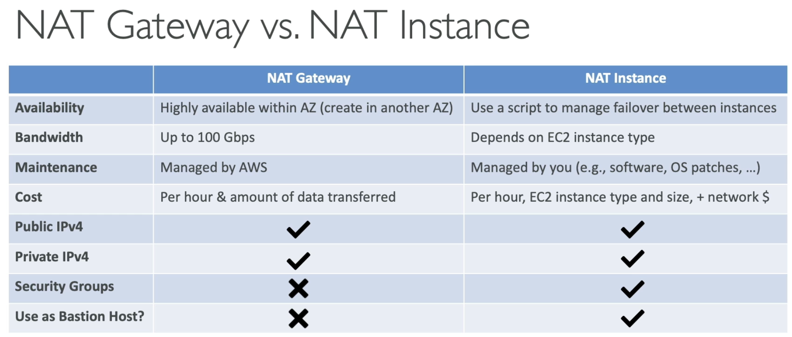

# Default VPC

  - All new accounts have a default VPC
  - New EC2 instances are launched into the default VPC if no subnet is specified
  - Default VPC has Internet Connectivity and all EC2 instances inside it have public IPv4 addresses
  - We also get a public and private IPv4 DNS names.
  - You may be able to see some default subnets created for your default VPC, and each of them will have its own IPv4 CIDR. Each subnet may be in different AZs to have high available architecture by default. Each subnet will have a route table and network ACL. The setting **auto-assign public IPv4** is enabled for these subnets. This feature makes any EC2 instance created in this default subnet have public IPv4.
  - In the default subnets if we look at the details of the network ACL assigned, we can see all inbound and outbound traffic will be allowed.
  - The route table helps the traffic being routed through the VPC. In the default route table we see 2 rules, one of them redirects 0.0.0.0/0 which is all traffic to an internet gateway. This main route table is not explicitly attached to any subnet but implicitly to those which dont have any route table attached.
  
# VPC 
  - Virtual Private Cloud
  - You can have multiple VPCs in an AWS region (max 5 region - soft limit - can be changed)
  - Max CIDR per VPC is 5, for each CIDR:
    - Min size is /28 (16 IP addresses)
    - Max size is /16 (65536 IP addresses)
  - Because VPC is private, only private IPv4 ranges are allowed:
    - 10.0.0.0 - 10.255.255.255 (10.0.0.0/8)
    - 172.16.0.0 - 172.31.255.255 (172.16.0.0/12)
    - 192.168.0.0 - 192.168.255.255 (192.168.0.0/16)
  - **<u> Your VPC CIDR should NOT overlap with your other VPCs or other n/w (e.g corporate)</u>**. In case in future we want to connect then then overlap will not allow that.
  - **Tenancy** defines how EC2 instances launch within this VPC either dedicated (very expensive) or shared.

- **VPC - Subnet (IPv4)**
  - AWS reserves **5 IP addresses (first 4 and last one)** in each subnet.
  - These 5 IP addresses are not available for use and cant be assigned to an EC2 instance.
  - Ex: if CIDR block 10.0.0.0/24, then reserved IP addresses are:
    - 10.0.0.0 - Network address
    - 10.0.0.1 - reserved by AWS for the VPC router
    - 10.0.0.2 - reserved by AWS for mapping to Amazon provided DNS
    - 10.0.0.3 - reserved by AWS for future use
    - 10.0.0.255 - Network Broadcast Address. AWS does not support boradcast in a VPC, so address is just reserved. 
  - **Exam Tip**, if you need 29 IP addresses for EC2 instances:
    - You cant choose a subnet of size /27 (32 IP addresses, 32-5 = 27 < 29>)
    - You need to choose a subnet of size /26 (64 IP addresses, 64-5 = 59 > 29)
  - For a **public subnet**, dont choose too many IP addresses, usually this is reserved for your load balancers or your front facing infrastructure. 
  - Public subnet should have the **auto-assign public IPv4** enabled.

- **Internet Gateway (IGW)**
  - Allows resources (eg EC2 instances) in a VPC connect to the Internet
  - It scales horizontally and is highly available and redundant. A well managed resource.
  - Must be created separately from a VPC
  - One VPC can only be attached to one IGW and vice versa
  - *Internet Gateways on their own do not allow internt access... Route tables must be edited*
  - When you create a new EC2 instance and define the required security group access, and put the instance in the a VPC and subnet. Then by default it will not have internet access. You will have to define and internet gateway for this.
  - When you create an internet gateway it will be in a detached state and then you can attach it to a VPC.
  - Even with the internet gateway created and attached to your VPC the Internet connection will still not work as we need to define route table.
  - The default route table will be associated with subnets that do not have explicit route-table association. This is implicit association.
  - For explicit subnet association, create own route table.
  - In the example with 2 public subnet and 2 private subnet, we create 2 route tables one is associated with the 2 public subnets and another associated with the 2 private subnets.
  - When editing the route table for the public subnet for example, there will be one route in it already say, 10.0.0.0/16 (our VPC CIDR) to go to local which means any IP within our VPC should be routed from within the VPC. We can then add another route to this route table so that any IP 0.0.0.0/0 (which doesnt match the existing rule), is routed to the internet gateway we just created (send traffic to the internet gateway).

- **Bastion Hosts**
    - We can use Bastion Host to SSH into our private EC2 instances.
    - The bastion is in the public subnet which is then connected to all other private subnets.
    - Bastion Host security group must allow inbound from the internet on port 22 from restricted CIDR, (dont allow from everywhere as this could be a security risk) for example the <u> public CIDR </u> of your corporation or intranet etc..
    - Restrict the EC2 security group of bastion host as much as possible to guarantee that only a few selec IPs can access it.
    - Security group of EC2 instance must allow (ssh on port 22) the Security group of the Bastion Host, or the <u> private IP</u> of the Bastion host.  

    
  (If users want to access EC2 instances in a private n/w, then Bastion host (another EC2 instance) is used.)  
  (Bastion host(EC2 instance) will be in a public subnet and has its own security group, called bastion host security group.)  
  (The EC2 instance on the private subnet also has a security group.)  
  (EC2 instance in our public subnet will have access to the EC2 instances in the private subnet of the **same VPC**.)  
  (Users will connect to the bastion host using ssh and then through that ssh to the EC2 in the private subnet.)  

- **NAT Instance (outdated)**
    - Network Address Translation
    - Replaced by NAT gateway.
    - Allows EC2 instances in private subnets to connect to the Internet.
    - Must be launched in a public subnet.
    - Must disable EC2 setting: **Source / destination check**
    - Must have Elastic IP attached to it
    - Route Tables must be configured to route traffic from private subnets to the NAT Instance.  
    
      
    (Here server 50.60.4.10 needs to be accessed from the private subnet)  
    (Launch NAT instance with its own security group in a public subnet)  
    (Next attach an Elastic IP to the NAT instance)  
    (Edit the route tables from the private subnet to the public subnet to be allowed to send traffic from the EC2 instances between the 2 subnets through the NAT instance)  
    (So when the request comes the src is the private IP(10.0.0.20) but the destination is public IP)  
    (Now when the NAT routes this request, the dest IP remains the same but the src will be different now, 12.34.56.78, which is public IP of the NAT instance)  
    (NAT instance **rewrite network packets** and the src is changed)  
    (Since here the src of the packets are being re-written by the NAT instances, hence the check source/destination must be disabled on the EC2 instance of the NAT instance)  

    - Pre-configured Amazon Linux AMI available - but reached End of Support on Dec 31,2020.
    - Not highly available / resilient setup out-of-the-box
        - Need to create ASG in multi-AZ + resilient user-data script
    - Internet traffic bandwidth depends on the EC2 instance type (less bandwidht for small instances)
    - You must manage Security Groups & rules:
        - Inbound: 
            - Allow HTTP/HTTPS traffic coming from Private Subnets (in our ex: 10.0.0.0/16)
            - Allow SSH from your home network (access is provide through Internet Gateway)
        - Outbound:
            - Allow HTTP/HTTPS traffic to Internet.
    (In the route table you need to add a new rule which routes all IP 0.0.0.0/0 to the NAT instance, to allow all Internet traffic to go through the NAT instance.)  
    (If you want to have ping working then you need to give access to ICMP, so add that to the security group rules)  

- **NAT Gateway**

    - AWS managed NAT, higher bandwidth, high availability, no administration
    - Pay per hour for usage and bandwidth
    - NATGW is created in a specific Availability Zone, uses an Elastic IP.
    - Cant be used by EC2 instance in the same subnet (only from other subnets)
    - Requires an IGW (Private Subnet -> NATGW -> IGW)
    - 5 Gbps of bandwidth with automatic scaling upto 100 Gbps
    - No Security Groups to manage / required.
      

    - **NAT Gateway is resilient within a single Availability Zone**
    - Must create **multiple NAT Gateways** in **Multiple AZs** for fault tolerance.
    - There is no cross-AZ failover needed because if an AZ goes down it doesnt need NAT.
      
    (If the AZ goes down in AZ-A then NAT goes down but since all EC2 instance in that AZ is down too, we dont need this NAT)  

- **NAT Instance Vs NAT Gateway**

  - If the NAT instance through which the IP traffic is routed goes down then the target of the route becomes a **Blackhole** 
  - We can remove the NAT instances and replace them with NAT Gateway in the routes wherever applicable.

