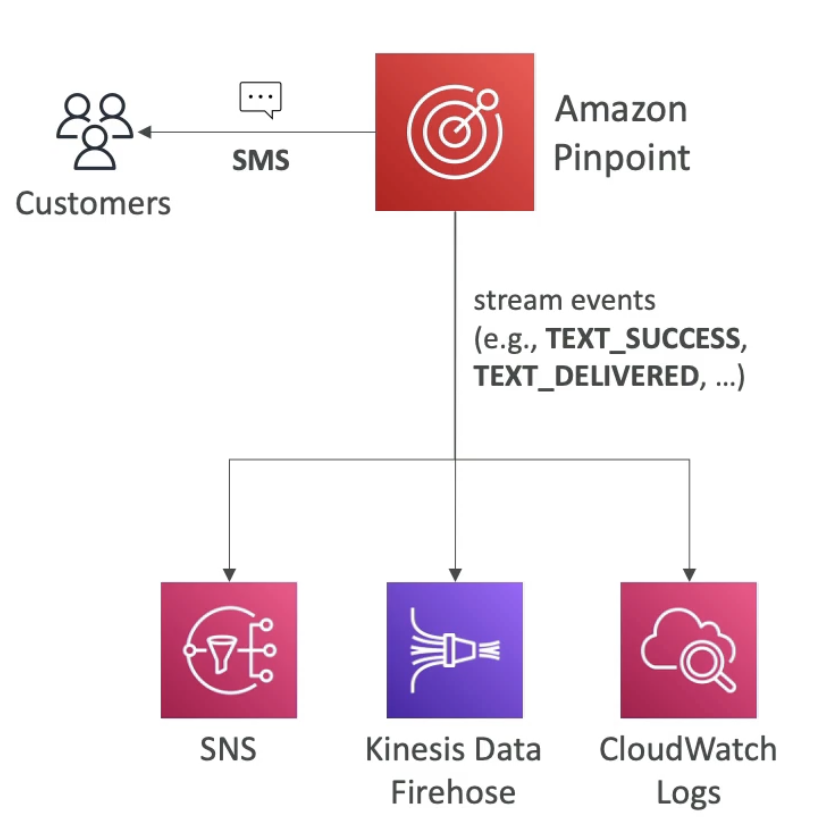
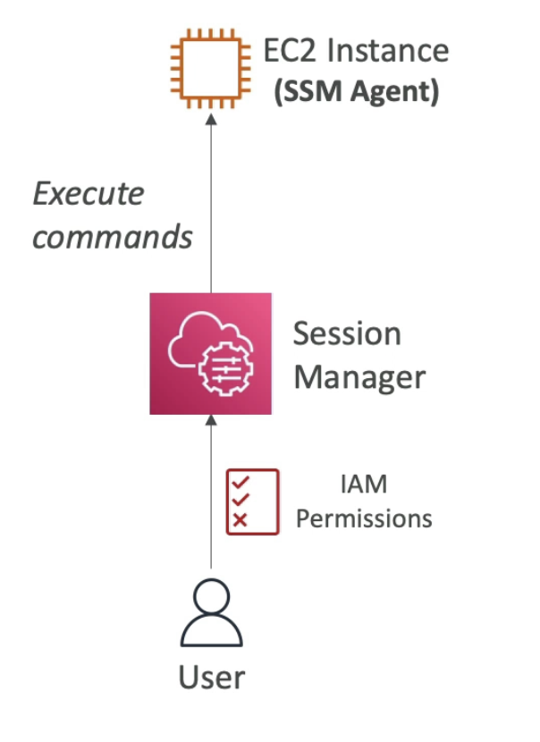
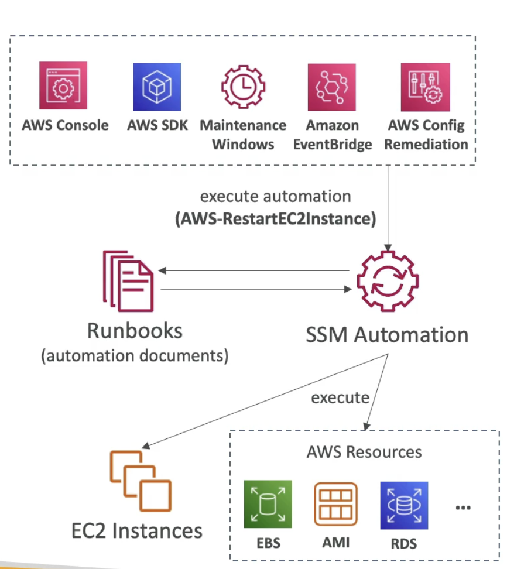
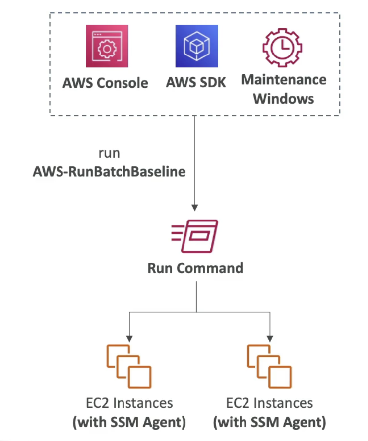
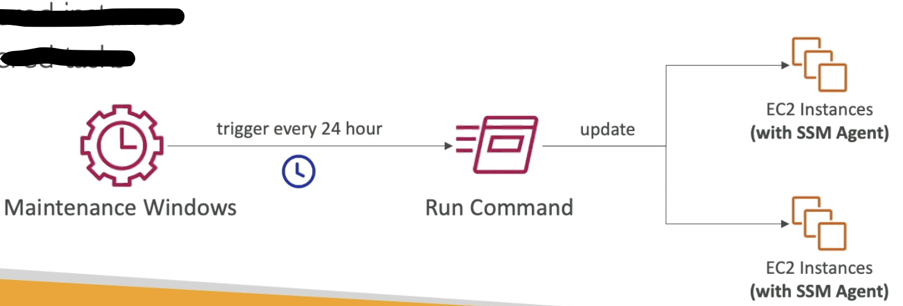
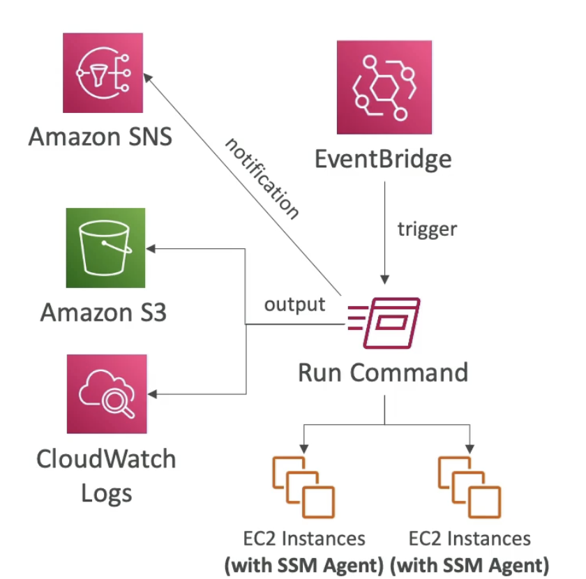
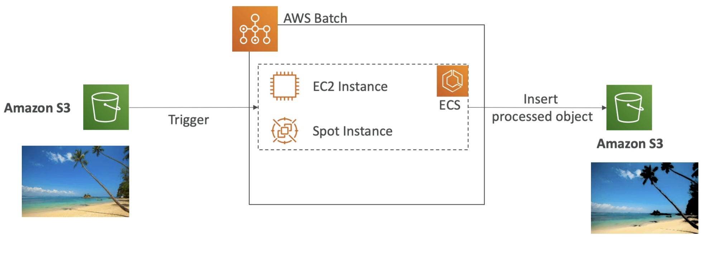
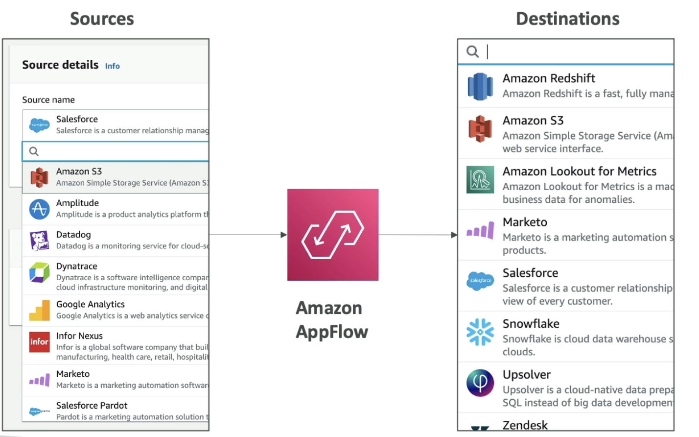
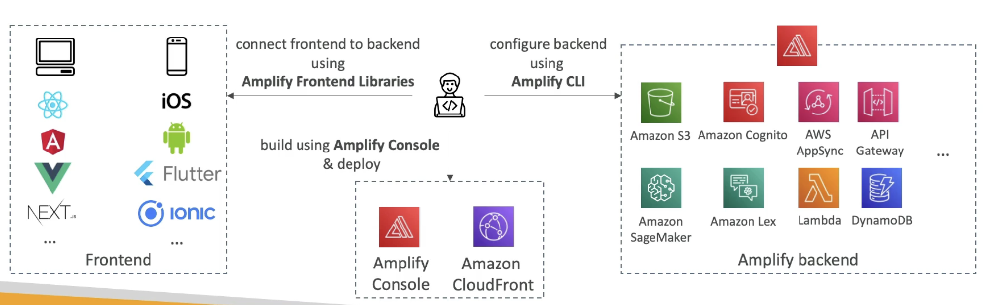

# CloudFormation

- ClodFormation is a declarative way of outlining your AWS Infrastructure, for any resources (most of them are supported)
- For ex: within a CloudFormation template, you say:
    - I want a security group
    - I want 2 EC2 instances using this security group
    - I want an S3 bucket
    - I want a load balancer (ELB) in front of these machines
- Then CloudFormation creates those for you, in the **right order**, with the **exact configuration** that you specify.

- **Benefits of CloudFormation**
    - **Infrastructure as code**
        - No resources are manually created, which is excellent for control
        - Changes to infrastructure are reviewed through code
    - **Cost**
        - Each resources within the stack is tagged with an identifier so you can easily see how much a stack costs you.
        - You can estimate the costs of your resources using the CloudFormation template
        - Saving strategy: In Dev, you could automate deletion of templates at 5PM and recreate at 8AM, safely
    - **Productivity**
        - Ability to destroy and re-create an infrastructure on the cloud on the fly
        - Automated generation of Diagram for your templates
        - Declarative programming (no need to figure out ordering and orchestration)
    - Dont re-invent the wheel
        - Leverage existing templates on the web
        - Leverage the documentation
    - **Supports (almost) all AWS resources**
        - You can use custom resources for resources that are not supported
- CloudFormation is used when we have infrastructure as code, when we need to repeat an architecture in different environments, different regions, or even different AWS accounts.

# Simple Email Service (SES)

- Fully managed service to send emails securely, globally and at scale
- Application will use SES API or SMTP server and SES will then send bulk emails to users
- Provide Reputation Dashboard (if you emails are open or not), performance insights, anti-spam feedback
- Provides statistics such as email deliveries, bounces, feedback, loop results, email open
- Supports standard security for email like DomainKeys Identified Mail (DKIM) and Sender Policy Framework (SPF)
- Flexible IP deployments: shared, dedicated and customer owned IPs (to send emails from specific IP address)
- Send emails in you application using AWS console, specific APIs or SMTP
- Use case: transactional, marketing, and bulk email communications

# Amazon Pinpoint 

- Scalable **2-way**(outbound/inbound) marketing communications service
- Supports email, SMS, push, voice, and in-app messaging
- Ability to segment and personalize messages with the right content to customers
- Possibility to receive replies
- Scales to billions of messages per day
- Use case: run campaigns by sending marketing, bulk, transactional SMS messages
- **Versus SNS or SES**
    - In SNS & SES you manage each message's audience, content, and delivery schedule. This is the responsibility of the application and may not be very scalable.
    - In Pinpoint, you create message templates, delivery schedules, highly targeted segments, and full campaigns. All of this is managed by Pinpoint service.
    - Hence Pinpoint can be seen as next evolution of SNS and SES if you want a full blown marketing communication service.

  
(If the service generate events for text delivered or text success when replied, then these events can be delivered to SNS, Kinesis Data Firehose and CloudWatch Logs)  
(Using this pattern you can build any kind of automation on top of pinpoint.)

# Systems Manager - SSM Session Manager

- Allows you to start a secure shell on your EC2 and on-premises servers.
- **No SSH access, bastion host, or SSH Keys needed**
- **No port 22 needed (better security)**. 
- Port 22 on your EC2 instance will be closed as there is no need to do SSH to establish a secure shell into the EC2 instance.
- The EC2 instance will have an **SSM agent** and that SSM agent is connected to the Session Manager service.
- Users can access through the Session Manager service the EC2 instance and execute sommands on it.

- Supports Linux, MacOS and Windows
- Send session log to S3 or CloudWatch Logs
- On the EC2 instance we need to create IAM role for permissions to access SSM service.
- Fleet Manager is the service where all EC2 instances registered with SSM will appear.
- To summarize there are 3 ways to access EC2 instances:
    - Open the port 22 and then use SSH keys and open a terminal with SSH command
    - Use EC2 instance connect, which does not require SSH keys, because they will be temporarily uploaded. But this requires port 22 to be open.
    - With session manager, but make sure that EC2 instance in Linux and that the instance has an IAM role which allows access from EC2 to the  Systems Manager.

- **Systems Manager - Run Command**
    - Run command is a feature in Sessions Manager.
    - Execute a document (= script) or just run a command.
    - Run commands across multiple instances (using resource groups). These instances or on-prem servers are registered with Systems Manager.
    - No need for SSH when we run the command. Same mechanism as we saw in session manager.
    - Command Output can be shown in AWS Console, sent to S3 bucket or CloudWatch logs.
    - Send notifications to SNS about command status (In progress, Success, Failed ..)
    - Integrated with IAM & CloudTrail
    - Can be invoked using EventBridge

    
    (There are EC2 instances with SSM agent running on them and we Run command on them)  
    (The output of the command can be sent to S3, CloudWatch Logs or notifications can be sent to SNS)  
    (The notification can be triggered by user or automatically using EventBridge)  

- **Systems Manager - Patch Manager**
    - Automates the process of patching managed instances
    - OS updates, application updates, security updates
    - Supports EC2 instances and on-premises servers
    - Supports Linux, macOS, and Windows
    - Patch on-demand or on a schedule using **Maintenance Windows**
    - Scan instances and generate patch compliance reports (missing patches)
    

- **Systems Manager - Maintenance Windows**
    - Defines a schedule for when to perform actions on your instances
    - Example: OS patching, updating drivers, installing software,...
    - Maintenance Window contains
        - Schedule
        - Duration
        - Set of registered instances
        - Set of registered tasks
    
    (Can be triggered every 24 hour to run the command to update or to patch EC2 instance)  

- **Systems Manager - Automation**
    - Simplifies common maintenance and deployment tasks of EC2 instances and other AWS resources
    - Examples: restart instances, create and AMI, EBS snapshot
    - **Automation Runbook** - SSM documents to define actions performed on your EC2 instances or AWS resources (pre-defined or custom)
        - These runbooks will be used by SSM Automation to execute some actions on EC2 instances like restart them or take snapshots of all RDS databases.
    - Can be triggered using
        - Manually using AWS Console, AWS CLI or SDK
        - Amazon EventBridge
        - On a schedule using Maintenance Windows
        - By AWS Config for rules remediations
      
    (SSM Automation can be triggered using the console, SDK, etc)  

# AWS Cost Explorer

- Visualize, understand, and manage your AWS costs and usage over time
- Create custom reports that analyze cost and usage data.
- Analyze your data at a high level; total costs and usage accross all acounts
- Or Monthly, hourly, resource level granularily
- Choose an optimal **Savings Plan** (to lower prices on your bill)
- **Forecast usage up to 12 months based on previous usage**

# AWS Elastic Transcoder

- Elastic Transcoder is used to convert media files stored in S3 into media file formats required by customer playback devices (phones etc..)
- Benefits
    - Easy to use
    - Highly Scalable - can handle large volumes of media files and large file sizes - the more S3 files you have the more processing power you will get
    - Cost effective - duration based pricing model
    - Fully managed and secure , pay for what you use

# AWS Batch

- **Fully Managed** batch processing at **any scale**
- Efficiently run 100,000s of computing batch jobs on AWS
- A "batch" job is a job with a start and an end (opposed to continuous). ex starts at 1 am and finishes at 3 am
- Batch job has a point of time when it happens.
- Batch will dynamically launch **EC2 instances** or **Spot Instances** to accomodate with the load that you have to run these batch jobs.
- AWS Batch provisions the right amount of compute / memory to deal with your batch queue.
- You submit or schedule batch jobs into the batch queue and AWS Batch does the rest!
- Batch jobs are defined as **Docker images** and **run on ECS** (a task definition)
- Helpful for cost optimization and focusing less on the infrastructure. (as it automatically scales and uses the right number of EC2/Spot instances to do the jobs)

(We want to process images submitted by users into S3 in batch)  
(When images are put to S3 and this will trigger a batch job you have in the bacth queue)  
(AWS Batch will automatically have a ECS Cluster made of EC2 or Spot instance and batch will make sure you have the right amount of instances to accomodate the load)  
(The docker images in ECS will do the job and insert the processed object in another S3)  

- **Batch Vs Lambda**
    - Lambda
        - Time Limit of 15 min
        - Limited Runtimes - access to a few programming languages
        - Limited temporary disk space if you want to run your jobs
        - Serverless 
    - Batch
        - No time limit
        - Any runtime as long as it's packaged as a Docker image
        - Rely on EBS/instance store for disk space
        - Relies on EC2 (can be managed by AWS so we dont worry about scaling etc) for storage

# Amazon AppFlow

- Fully managed integrations service that enables you to securely transfer data between **Software-as-a-Service applications and AWS**
- These integrations are quite difficult to write but with AppFlow they are easy.
- <u>Sources</u>: **Salesforce**, SAP, Zendesk, Slack, and ServiceNow
- <u>Destinations</u>: S3, RedShift or non-AWS such as SnowFlake and Salesforce.
- <u>Frequency</u>: You can define integrations to run on a schedule or in response to events or on demand.
- <u>Data transformation</u>: capabilities like filtering and validation
- <u>Encrypted</u> over the public internet or privately over AWS PrivateLink
- Dont spend time writing the integrations and leverage APIs immidiately.

# AWS Amplify - web and mobile applications

- A set of tools and services that help you develop and deploy scalable full stack web and mobile applications
- This service will allow you to integrate a lot of AWS stack into one place to build your web and mobile applications.
- With Amplify we have one place to configure authentication, storage, API will be REST API or GraphQL API, CI/CD, PubSub, Analytics, AI/ML predictions, monitoring etc

(Developer want to first create a Backend, for this we use Amplify CLI to create Amplify Banckend)  
(This Backend will internally use a lot of AWS resources)  
(Then add Ampify frontend libraries to connect to the Backend)    
(Frontend libraries for web applications, mobile applications and many other frameworks)  
(Finally when you are ready you will deploy using Amplify console to Amplify itself and Amazon CloudFront for your web or mobile application to be available)  
(Think of Amplify as the Elastic Beanstalk for web and mobile applications.)